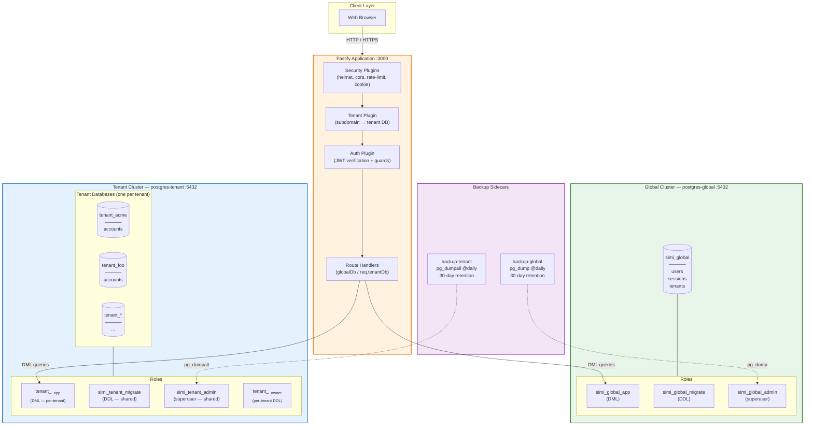
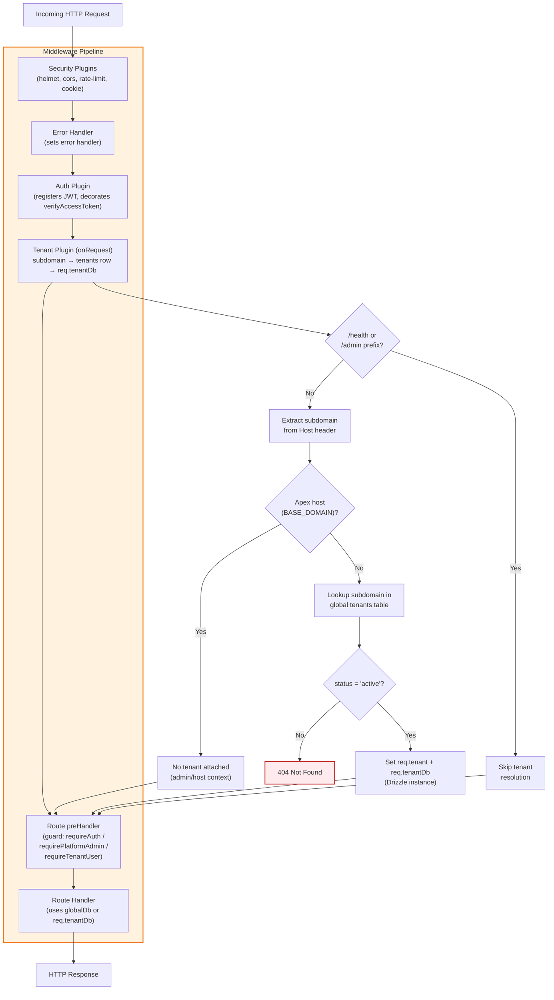
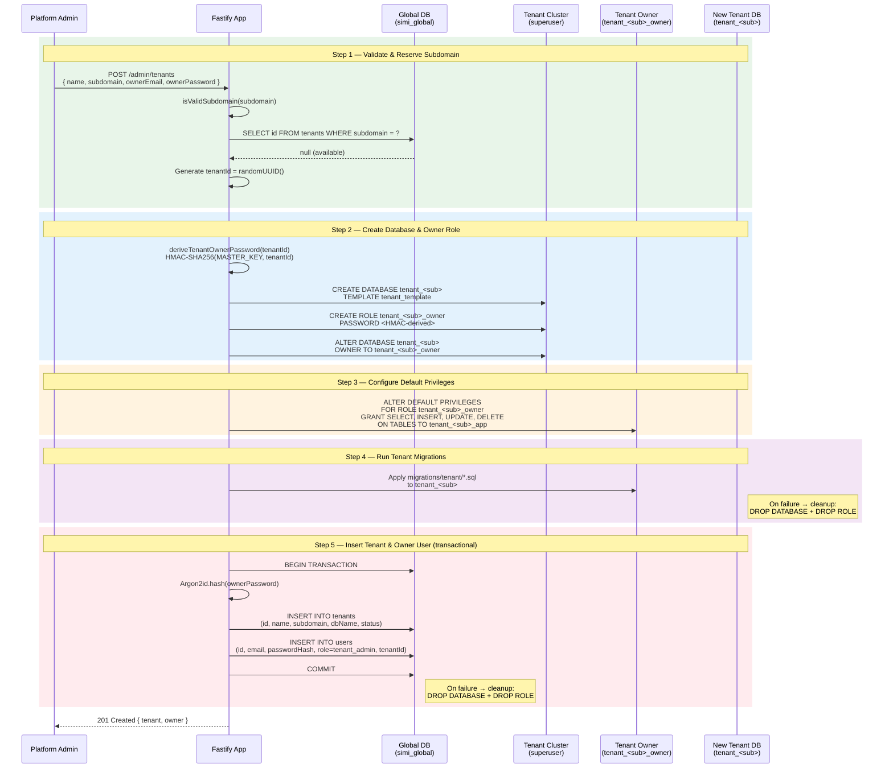
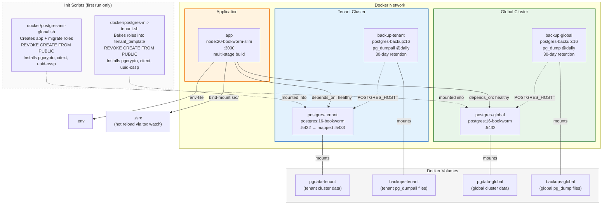

# Simi Backend — Architecture Diagrams

> Mermaid diagrams describing the backend API and infrastructure.
> Render in VS Code (preview), GitHub, or any Mermaid-compatible viewer.

---

## Table of Contents

1. [System Architecture Overview](#1-system-architecture-overview)
2. [Request Lifecycle](#2-request-lifecycle)
3. [Data Model (ER Diagram)](#3-data-model-er-diagram)
4. [Authentication & Token Flow](#4-authentication--token-flow)
5. [Tenant Isolation Stack](#5-tenant-isolation-stack)
6. [Tenant Provisioning Flow](#6-tenant-provisioning-flow)
7. [Docker / Infrastructure Topology](#7-docker--infrastructure-topology)

---

## 1. System Architecture Overview

High-level view of the two-cluster multi-tenant architecture. Each tenant gets its own
physical PostgreSQL database on a separate cluster from the global database, providing
blast-radius containment.



---

## 2. Request Lifecycle

Every HTTP request flows through the same middleware pipeline. The tenant plugin
determines which database the request operates against, and the auth guards enforce
authorization before the handler executes.



---

## 3. Data Model (ER Diagram)

The schema is split across two physically separate databases. The **global DB** holds
authentication, users, and the tenant registry. Each **tenant DB** holds the tenant's
business data (currently `accounts` as a sample entity).

```mermaid
erDiagram
    %% ── Global Database: simi_global ──────────────────────────────

    tenants {
        uuid id PK
        varchar120 name "NOT NULL"
        varchar63 subdomain "NOT NULL, UNIQUE"
        varchar128 dbName "NOT NULL"
        varchar20 status "NOT NULL, default 'active'"
        timestamptz createdAt "NOT NULL"
        timestamptz updatedAt "NOT NULL"
    }

    users {
        uuid id PK
        varchar254 email "NOT NULL, UNIQUE"
        text passwordHash "NOT NULL"
        varchar30 role "NOT NULL"
        uuid tenantId "FK → tenants.id, nullable, CASCADE"
        varchar80 firstName "nullable"
        varchar80 lastName "nullable"
        timestamptz createdAt "NOT NULL"
        timestamptz updatedAt "NOT NULL"
    }

    sessions {
        uuid id PK
        uuid userId "FK → users.id, CASCADE"
        text refreshHash "NOT NULL"
        text userAgent "nullable"
        text ip "nullable"
        timestamptz expiresAt "NOT NULL"
        timestamptz revokedAt "nullable"
        timestamptz createdAt "NOT NULL"
    }

    %% ── Tenant Database (one per tenant) ──────────────────────────

    accounts {
        uuid id PK
        varchar160 name "NOT NULL"
        varchar254 email "nullable"
        varchar40 phone "nullable"
        text notes "nullable"
        timestamptz createdAt "NOT NULL"
        timestamptz updatedAt "NOT NULL"
    }

    %% ── Relationships ────────────────────────────────────────────

    tenants ||--o{ users : "has members\n(users.tenantId → tenants.id)"
    users ||--o{ sessions : "has sessions\n(sessions.userId → users.id)"

    %% ── Indexes & Constraints (annotations) ────────────────────────

    tenants {
        Index: tenants_subdomain_idx "UNIQUE ON subdomain"
    }

    users {
        Index: users_email_idx "UNIQUE ON email"
        Index: users_tenant_idx "ON tenantId"
        Index: users_role_idx "ON role"
    }

    sessions {
        Index: sessions_refresh_hash_idx "ON refreshHash"
        Index: sessions_user_idx "ON userId"
        Index: sessions_refresh_hash_active_uniq "UNIQUE partial\nWHERE revoked_at IS NULL"
    }
```

---

## 4. Authentication & Token Flow

The auth system uses **short-lived JWT access tokens** (15 min) and **opaque refresh
tokens** (30 days) stored as HttpOnly cookies. Token rotation on every refresh includes
reuse detection — if an already-revoked token is presented, all sessions for that user
are revoked (theft detection).

```mermaid
sequenceDiagram
    participant C as Client (Browser)
    participant A as Fastify App
    participant G as Global DB (simi_global)

    %% ── Login ────────────────────────────────────────────────────
    rect rgb(227, 242, 253)
        Note over C,G: POST /auth/login
        C->>A: email + password
        A->>G: SELECT * FROM users WHERE email = ?
        G-->>A: user row (incl. passwordHash)
        A->>A: Argon2id.verify(password, passwordHash)
        alt credentials valid
            A->>A: Generate 32-byte refresh token (opaque)
            A->>A: SHA-256 hash of refresh token
            A->>G: INSERT INTO sessions (userId, refreshHash, expiresAt, …)
            A->>A: Sign JWT access token (sub, role, tenantId, type=access)
            A-->>C: { accessToken, user } + Set-Cookie: rt=<refresh_token>; HttpOnly; SameSite=strict
        else credentials invalid
            A-->>C: 401 Unauthorized
        end
    end

    %% ── Token Refresh ────────────────────────────────────────────
    rect rgb(232, 245, 233)
        Note over C,G: POST /auth/refresh
        C->>A: Cookie: rt=<refresh_token> (or body)
        A->>A: SHA-256 hash of refresh token
        A->>G: SELECT * FROM sessions WHERE refreshHash = ? AND revokedAt IS NULL
        G-->>A: session row (or null)
        alt session found and active
            A->>G: UPDATE sessions SET revokedAt = now() WHERE id = ? AND revokedAt IS NULL
            A->>A: Generate NEW refresh token + hash
            A->>G: INSERT INTO sessions (userId, refreshHash, expiresAt, …)
            A->>A: Sign NEW JWT access token
            A-->>C: { accessToken, user } + Set-Cookie: rt=<new_refresh_token>
        else session NOT found (hash miss)
            A-->>C: 401 Unauthorized
        else session found but revoked (reuse detection!)
            Note over A,G: ⚠ Token reuse detected — assumed theft
            A->>G: UPDATE sessions SET revokedAt = now() WHERE userId = ? AND revokedAt IS NULL
            A-->>C: 401 Unauthorized (ALL sessions revoked)
        end
    end

    %% ── Logout ───────────────────────────────────────────────────
    rect rgb(252, 228, 236)
        Note over C,G: POST /auth/logout
        C->>A: Cookie: rt=<refresh_token>
        A->>A: SHA-256 hash of refresh token
        A->>G: UPDATE sessions SET revokedAt = now() WHERE refreshHash = ?
        A-->>C: 204 No Content + Clear Cookie
    end

    %% ── Authenticated Request ────────────────────────────────────
    rect rgb(255, 243, 224)
        Note over C,G: GET /accounts (or any protected route)
        C->>A: Authorization: Bearer <access_token>
        A->>A: Verify JWT signature + claims
        A->>A: Check guard (requireAuth / requireTenantUser / requirePlatformAdmin)
        A->>A: Execute handler using globalDb or req.tenantDb
        A-->>C: 200 OK + data
    end
```

---

## 5. Tenant Isolation Stack

Five layers of defense-in-depth ensure tenant data cannot leak across boundaries.
All five layers are required; no single layer is considered sufficient on its own.

```mermaid
flowchart LR
    subgraph L1["Layer 1 — Network"]
        N1["Two physical PostgreSQL clusters"]
        N2["Global cluster ↔ tenant cluster\ntraffic is impossible"]
    end

    subgraph L2["Layer 2 — Role"]
        R1["3-tier roles per cluster\n(admin / migrate / app)"]
        R2["Per-tenant owner roles\n(tenant_<sub>_owner)"]
        R3["REVOKE CREATE ON SCHEMA public\nFROM PUBLIC"]
    end

    subgraph L3["Layer 3 — Application"]
        A1["Subdomain → tenant lookup\n(plugins/tenant.ts)"]
        A2["JWT tenantId == resolved tenant.id\n(plugins/auth.ts)"]
        A3["No API to open arbitrary tenant DB\n(db/tenant-pool.ts)"]
    end

    subgraph L4["Layer 4 — Schema"]
        S1["Separate schema barrels\n(global vs tenant)"]
        S2["No cross-schema foreign keys\n(different physical DBs)"]
    end

    subgraph L5["Layer 5 — Backup"]
        B1["Separate backup volumes"]
        B2["Global backup has no tenant data\nTenant backup has no global data"]
    end

    L1 --> L2 --> L3 --> L4 --> L5

    style L1 fill:#e3f2fd,stroke:#1565c0,stroke-width:2px
    style L2 fill:#e8f5e9,stroke:#2e7d32,stroke-width:2px
    style L3 fill:#fff3e0,stroke:#ef6c00,stroke-width:2px
    style L4 fill:#fce4ec,stroke:#c62828,stroke-width:2px
    style L5 fill:#f3e5f5,stroke:#7b1fa2,stroke-width:2px
```



### How isolation is enforced at each layer

| Layer | Mechanism | What it prevents |
|-------|-----------|-----------------|
| **1 — Network** | Two separate PostgreSQL clusters | A leaked superuser on one cluster cannot reach the other |
| **2 — Role** | 3-tier roles + per-tenant owners + `REVOKE CREATE` | DML-only app roles cannot install `dblink`/`postgres_fdw` for lateral moves |
| **3 — Application** | Subdomain resolution + JWT tenantId check | A valid token for tenant A cannot be used on tenant B's subdomain |
| **4 — Schema** | Separate schema barrels, no cross-DB foreign keys | Code-level guarantee that global and tenant queries never mix |
| **5 — Backup** | Separate backup volumes per cluster | Leaked global backup exposes no tenant data and vice versa |

---

## 6. Tenant Provisioning Flow

Provisioning a new tenant is a multi-step process that spans both clusters. The
sequence diagram below shows the happy path. On failure at any step after the database
is created, cleanup drops the database and owner role to prevent orphans.



---

## 7. Docker / Infrastructure Topology

The `docker-compose.yml` defines five services across two PostgreSQL clusters. The app
waits for both database clusters to be healthy before starting.



### Service details

| Service | Image | Port | Health Check | Volume |
|---------|-------|------|-------------|--------|
| `postgres-global` | `postgres:16-bookworm` | 5432 | `pg_isready` | `pgdata-global` |
| `postgres-tenant` | `postgres:16-bookworm` | 5432 → 5433 | `pg_isready` | `pgdata-tenant` |
| `backup-global` | `postgres-backup:16` | — | `@daily` schedule | `backups-global` |
| `backup-tenant` | `postgres-backup:16` | — | `@daily` schedule | `backups-tenant` |
| `app` | Multi-stage Dockerfile | 3000 | `GET /health` (30s) | — |

### 3-tier role model per cluster

```
┌─────────────────────────────────────────────────────────────┐
│  Tier           │  Can DDL?  │  Can DML?  │  Used by        │
├─────────────────┼────────────┼────────────┼─────────────────┤
│  admin          │  Yes       │  Yes       │  Backups,       │
│  (superuser)    │            │            │  provisioning,  │
│                 │            │            │  break-glass     │
├─────────────────┼────────────┼────────────┼─────────────────┤
│  migrate        │  Yes       │  No        │  db:migrate,    │
│  (DDL only)     │            │            │  drizzle-kit    │
├─────────────────┼────────────┼────────────┼─────────────────┤
│  app            │  No        │  Yes       │  Runtime pools  │
│  (DML only)     │            │            │  (Fastify)      │
├─────────────────┼────────────┼────────────┼─────────────────┤
│  owner*         │  Yes*      │  Yes*      │  Per-tenant     │
│  (per-tenant)   │            │            │  migrations     │
└─────────────────────────────────────────────────────────────┘
* Tenant cluster only. Each tenant gets its own owner role
  with HMAC-SHA256 derived password.
```

---

## API Endpoints Reference

| Method | Path | Auth Guard | Rate Limit | Description |
|--------|------|-----------|------------|-------------|
| `GET` | `/health` | None | None | Health check (public) |
| `POST` | `/auth/register` | `requireTenantAdmin` | 5/min | Register a new user under a tenant |
| `POST` | `/auth/login` | None | 10/min | Authenticate and receive tokens |
| `POST` | `/auth/refresh` | None (cookie) | 20/min | Rotate refresh token, get new access token |
| `POST` | `/auth/logout` | None (cookie) | None | Revoke refresh token session |
| `GET` | `/auth/me` | `requireAuth` | None | Get current authenticated user |
| `GET` | `/admin/tenants` | `requirePlatformAdmin` | None | List all tenants (apex host only) |
| `POST` | `/admin/tenants` | `requirePlatformAdmin` | None | Provision a new tenant |
| `PATCH` | `/admin/tenants/:id/status` | `requirePlatformAdmin` | None | Update tenant status (active/suspended) |
| `GET` | `/accounts` | `requireTenantUser` | None | List accounts (tenant-scoped) |
| `GET` | `/accounts/:id` | `requireTenantUser` | None | Get single account |
| `POST` | `/accounts` | `requireTenantAdmin` | None | Create account |
| `PATCH` | `/accounts/:id` | `requireTenantAdmin` | None | Update account |
| `DELETE` | `/accounts/:id` | `requireTenantAdmin` | None | Delete account |
